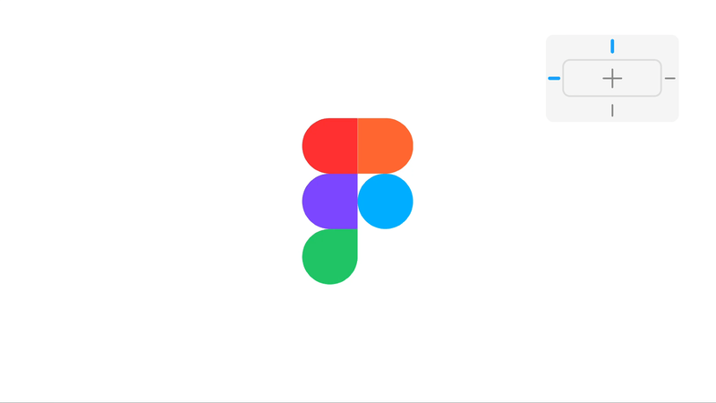

# Bulk Scale

A simple and efficient Figma plugin that automatically sets scale constraints for multiple selected layers at once.

## Features

- **Bulk Constraint Setting**: Set scale constraints for multiple layers simultaneously
- **Recursive Processing**: Automatically applies constraints to all child layers within selected frames/groups
- **Smart Detection**: Only applies constraints to compatible layer types
- **Instant Execution**: No UI needed - just select layers and run the plugin
- **Notification Feedback**: Shows count of successfully updated layers
- **Error Handling**: Gracefully handles incompatible layers without breaking

## How to Use

1. Select the layers, frames, or groups you want to set scale constraints for
2. Run the "Bulk Scale" plugin from your Figma plugins list
3. The plugin will automatically set both horizontal and vertical constraints to "SCALE" for all compatible layers
4. A notification will show how many layers were updated

## Supported Layer Types

The plugin works with all layer types that support constraints, including:
- Rectangles
- Ellipses
- Text layers
- Vector shapes
- Stars
- Lines
- Polygons
- And more...

## Installation

1. Download the plugin files
2. In Figma, go to Plugins > Development > Import plugin from manifest
3. Select the `manifest.json` file
4. The plugin will be available in your plugins list

## Requirements

- Figma desktop app or Figma web
- Layers selected before running the plugin 